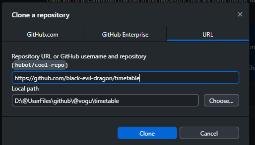

# Гайд

## Как форкнуть проект?
1. Зайди на GitHub в репозиторий
2. Нажми кнопку **Fork** (справа сверху)
	
	
3. У тебя появится копия: `твой-логин/book-catalog`
	

## Как склонировать проект?
### Через Github Desktop

1. Зайди на страницу своего форка (`твой-логин/book-catalog`).
2. Нажми на кнопку **<> Code**.
3. Выбери вариант **Open with GitHub Desktop**. Браузер предложит открыть приложение — подтверди действие.
4. В открывшемся GitHub Desktop проверь **Local Path** (папку, куда сохранится проект) и нажми **Clone**
	

## Как отправить задание на проверку?

1. **Открой свой форк**  
    Зайди в свой профиль и выбери репозиторий `твой-логин/book-catalog`. Убедись, что ты видишь надпись: _"This branch is X commits ahead of..."_.
    
2. **Начни создание Pull Request**  
    Над списком файлов нажми кнопку **Contribute**, а в выпадающем меню — **Open pull request**.
	
    
3. **Проверь направление (Base и Head)**  
    GitHub покажет сравнение веток. Сверху должно быть:
    - `base repository: [оригинал]` ← `head repository: твой-логин/book-catalog`
    - **Проверь, что ты отправляешь свою ветку!**

4. **Создай запрос**  
    Нажми большую зеленую кнопку **Create pull request**.

5. **Опиши работу**  
    В поле заголовка напиши свою фамилию. Снова нажми **Create pull request** внизу формы
	

6. **Сдай ссылку**  
    Скопируй адрес страницы из адресной строки браузера (он будет выглядеть как `.../pull/1`) — это и есть ссылка на твою работу

