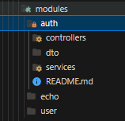
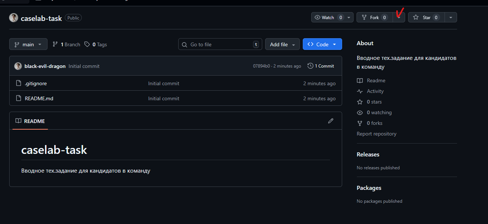
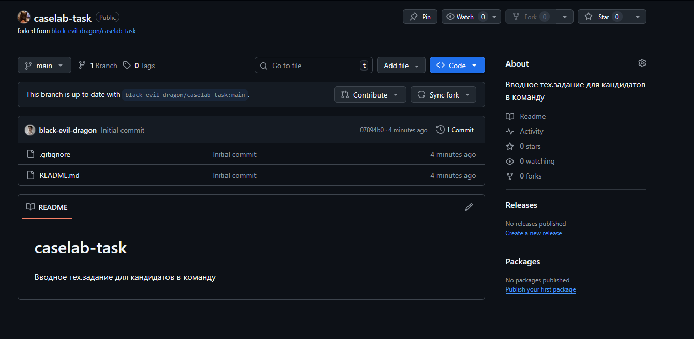
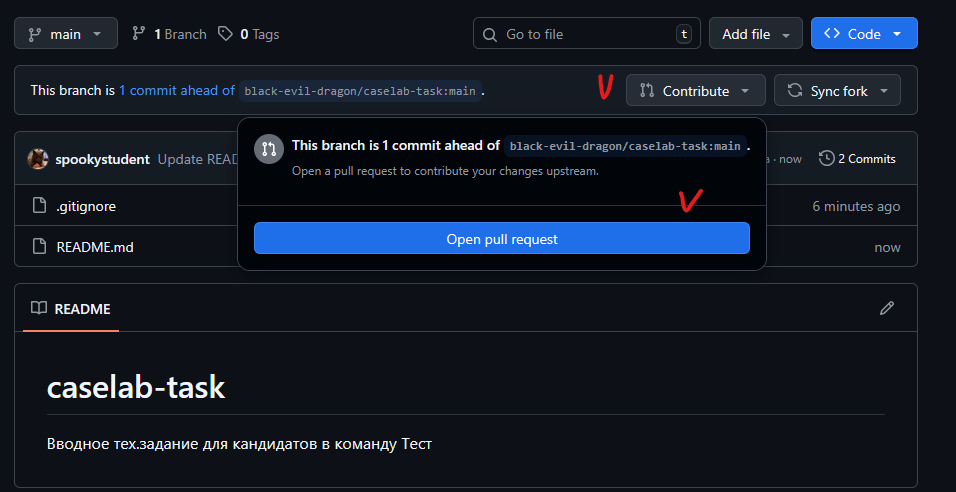
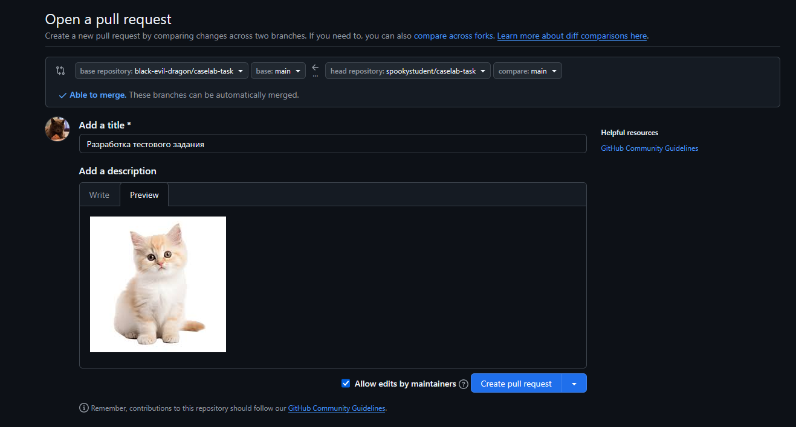

# CaseLab. Тестовое задание на backend-разработку

Привет! Если ты читаешь этот текст - значит, мы рассматриваем тебя как потенциального участника нашей команды. Это задание поможет нам понять твой уровень подготовки, а тебе - познакомиться с тем, как мы работаем :D

Мы не ищем сеньоров, мы ищем тех, у кого полным-полно энтузиазма и кто ответственный, хочет расти и учиться!

# Введение
Может функционал слишком примитивный, но на первых шагах видение как разработать хотя бы это тоже неплохо, во всяком случае, он отличается лишь масштабом, а действия абсолютно одинаковые

> *Сначала вы учитесь держать равновесие и крутить педали, а потом уже едете куда угодно*

А какие действия? Наш бэкенд построен на архитектуре MVC (Model, View, Controller)
```txt
M — Model (Модель) — данные, с которыми работаем (книги)
V - View (Представление) — то, что видит пользователь (т.е JSON)
C - Controller (Контроллер) — обработчик запросов
```

Пример модуля и API-endpoint'a `GET /api/echo/hello` (*на запущенном проекте*): http://localhost:8080/api/echo/hello
- В проекте `src/main/java/com/caselab/task` есть папка `modules`, в ней модуль `echo`
- У каждого модуля есть свои `controllers`, `services`, `models`

Пример модулей в разрабатываемом CaseLab


В реальном проекте добавляются новые слои, но принцип тот же

|             Наш проект              |           Реальный проект           |
| :---------------------------------: | :---------------------------------: |
|             Контроллер              |             Контроллер              |
|               Сервис                |       Сервис (сложная логика)       |
| Список книг в памяти (в переменной) |      База данных (PostgreSQL)       |
|                                     |  Репозиторий (JPA для работы с БД)  |
|                                     |  DTO (чтобы не светить все данные)  |
|                                     | Валидация (проверка входных данных) |
|                                     |      Безопасность (JWT токены)      |
|                                     |    Логирование (запись событий)     |
|                                     |          Обработка ошибок           |

---

# Цель
Мы создадим простой REST API, который умеет отдавать список книг и информацию по конкретной книге. Это как маленький backend для книжного магазина или библиотеки

---
#  Задачи

- [ ] **Склонировать проект**
	1. Зайди на GitHub в репозиторий
	2. Нажми кнопку **Fork** (справа сверху)
		
	3. У тебя появится копия: `твой-логин/book-catalog`
		
- [ ] **Создай ветку со своей фамилией**
	Например: `feature/golgan-task`

- [ ] **В процессе разработки сделай минимум 3 коммита**
	Например (названия коммитов): Добавленние апи путей в контроллере, разработка bookService, исправление ошибок 
	*\*Можно и на английском*

- [ ] **Отправь в свой форк**
	

	**Проверь, что ты отправляешь свою ветку!**
	


---
# Требования

## Вайб-кодинг != Обучение
Плз, минимум вайб-кодинга, первые шаги стараемся делать самостоятельно. 

НО!
- Допустимо использовать ИИ для объяснения, ревью и тд-тп. Например: объяснение MVC, организация проекта, проверить нейминги переменных, как работает контроллер или сервис, как сделать валидацию входных данных....
  
- ИИ может начать генерировать монотонный код с доп функционалом, улучшениями, библиотеками и прочем, для вас это будет сплошной фонтан непонятно чего. Старайтесь избегать этого, просить сделать, как можно проще, придерживайтесь принципа **Keep it simple, stupid**
  https://ru.wikipedia.org/wiki/KISS_(%D0%BF%D1%80%D0%B8%D0%BD%D1%86%D0%B8%D0%BF)
## По функционалу
1. **Код работает** - по `GET /api/books `приходит список книг
2. **Код работает** - по `GET /api/books/1` приходит конкретная книга
3. **Код работает** - по `GET /api/books/999` приходит 404 ошибка
4. **Git** - есть минимум 3 коммита
5. **Git** - ветка названа правильно
6. **Git** - создан Pull Request

## Что иметь в коде
1. **Модель Book**
```java
public class Book {
    private Long id;
    private String title;
    private String author;
    private Integer year;
}
```

2. **API-endpoints в контроллере**
```http
GET    /api/books     - вернуть список всех книг
GET    /api/books/1   - вернуть книгу с id=1
GET    /api/books/<id которого нет> - вернуть 404 Not Found
```

*Пример ответов:*
```http
GET /api/books
[
  {
    "id": 1,
    "title": "Война и мир",
    "author": "Толстой",
    "year": 1869
  },
  {
    "id": 2,
    "title": "Преступление и наказание",
    "author": "Достоевский",
    "year": 1866
  }
]
```

```http
GET /api/books/1
{
  "id": 1,
  "title": "Война и мир",
  "author": "Толстой",
  "year": 1869
}
```

3. **Данные** *(можно захардкодить)*
```java
List<Book> books = Arrays.asList(
    new Book(1, "Война и мир", "Толстой", 1869),
    new Book(2, "Преступление и наказание", "Достоевский", 1866),
    new Book(3, "Мастер и Маргарита", "Булгаков", 1967)
);
```


---
# Подсказка
```java
@GetMapping("/{id}")
public ResponseEntity<Book> getBookById(@PathVariable Long id) {
    Book book = bookService.findById(id);
    if (book == null) {
        return ResponseEntity.notFound().build();
    }
    return ResponseEntity.ok(book);
}
```